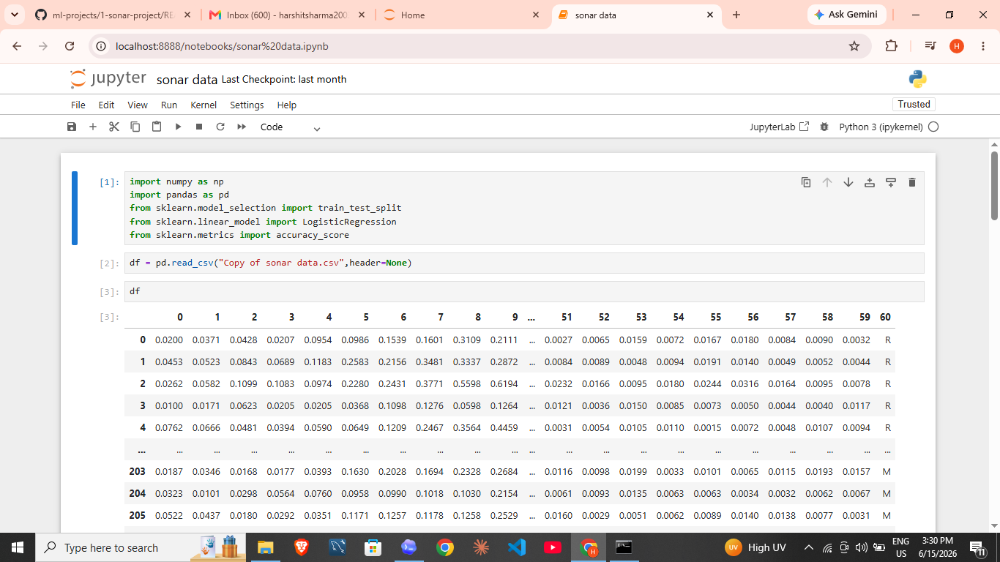
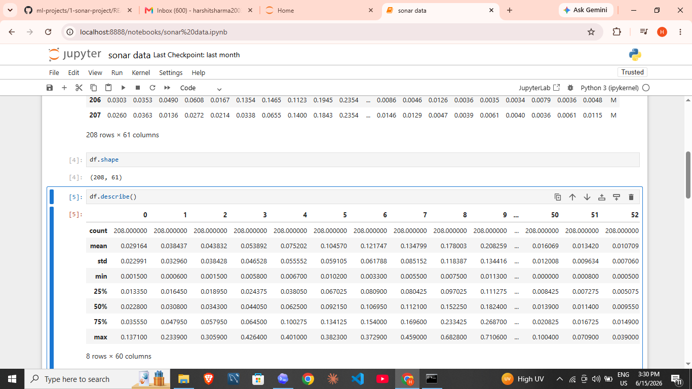
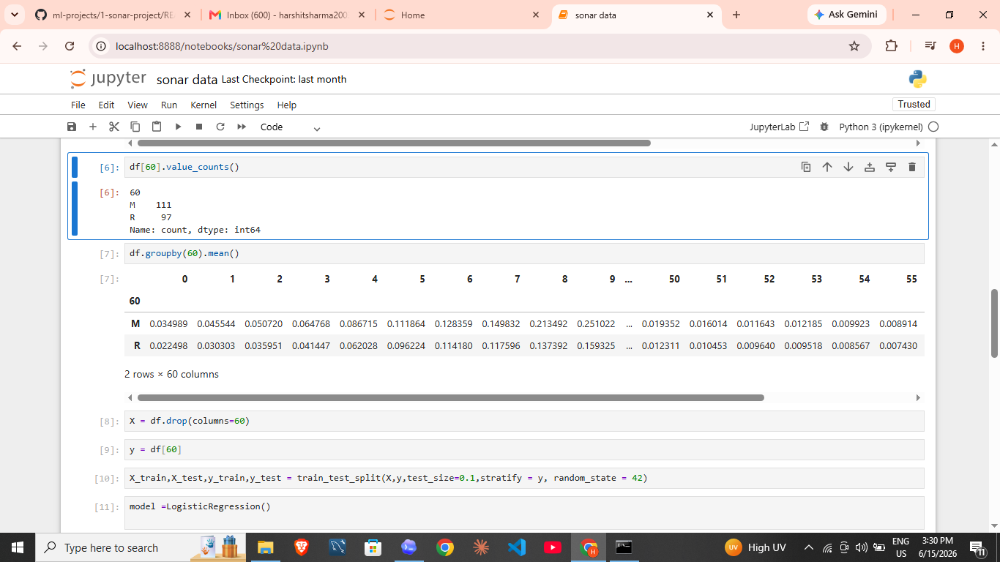
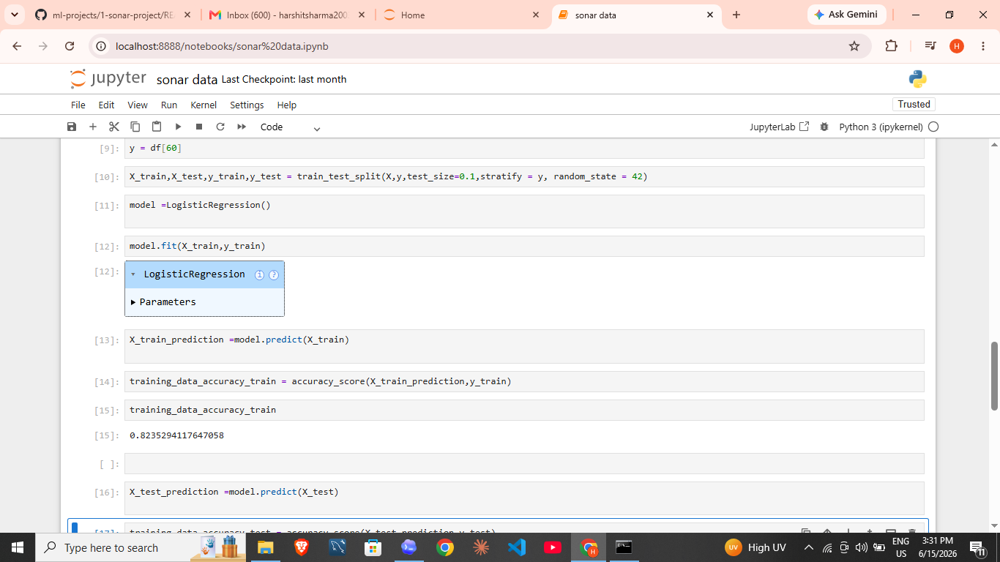
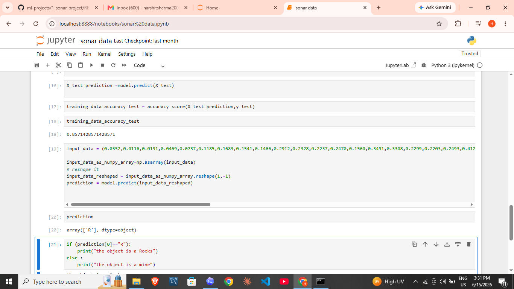
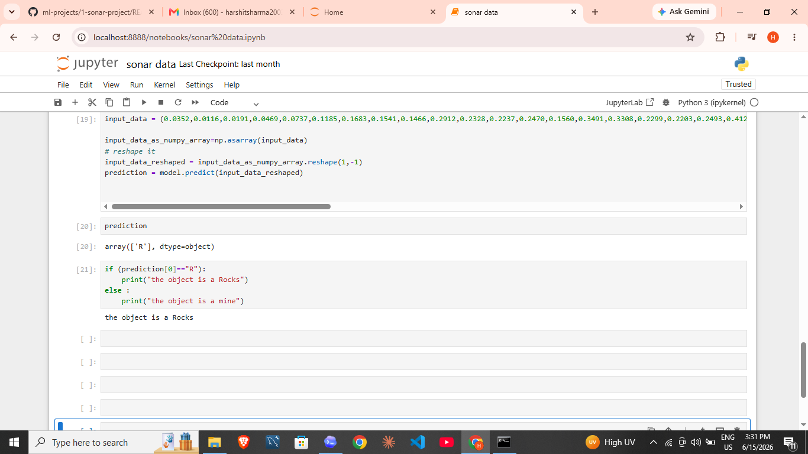

# Sonar Project

Machine learning project that classifies sonar signal readings as either rock or mine using logistic regression.

## Screenshots








## Files

- `data/sonar.csv`: dataset used by the project
- `notebooks/sonar_rock_vs_mine_prediction.ipynb`: Jupyter notebook
- `src/train.py`: runnable Python training script
- `requirements.txt`: Python dependencies

## Run

```bash
pip install -r requirements.txt
python src/train.py
```
