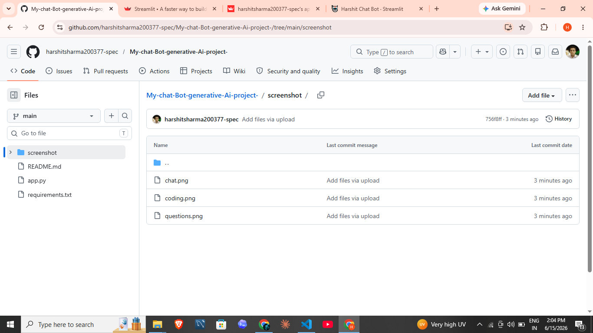
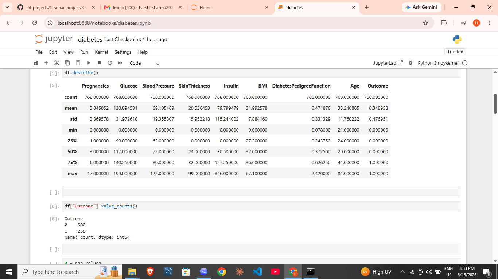
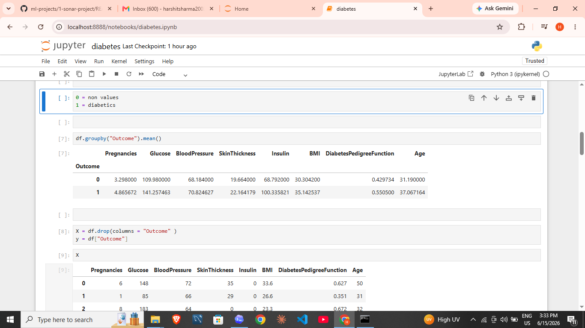
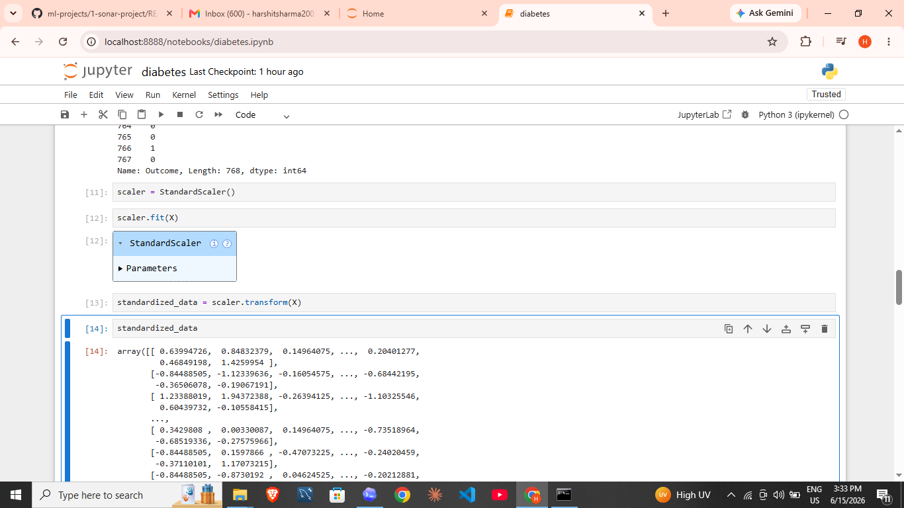
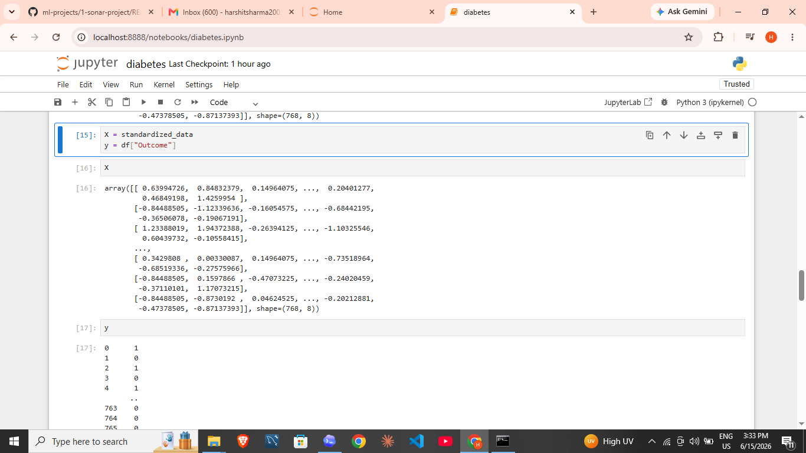
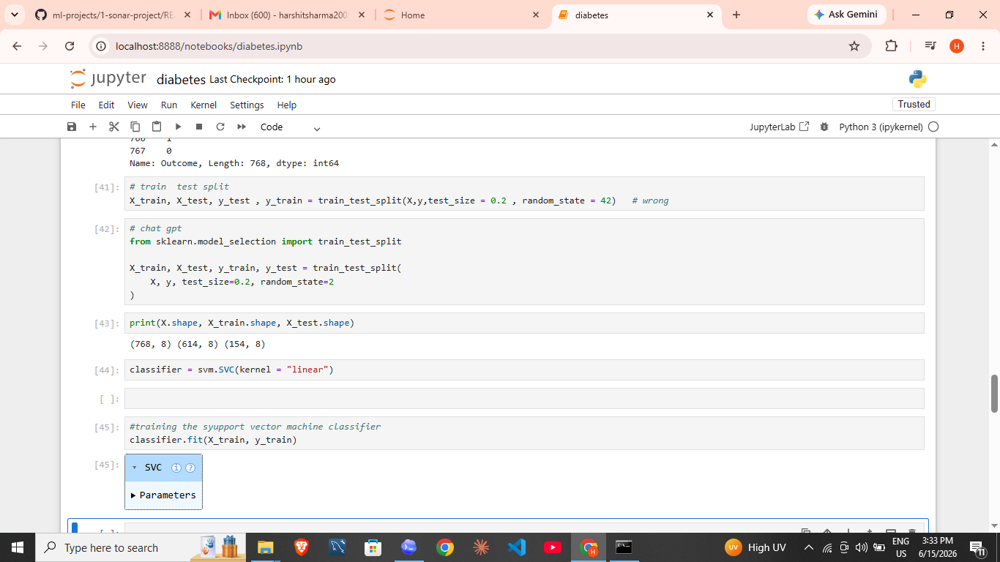
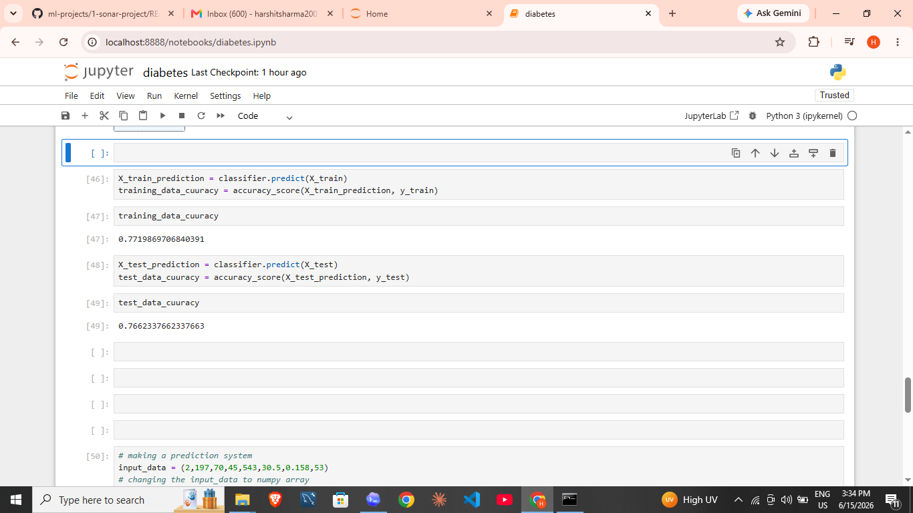
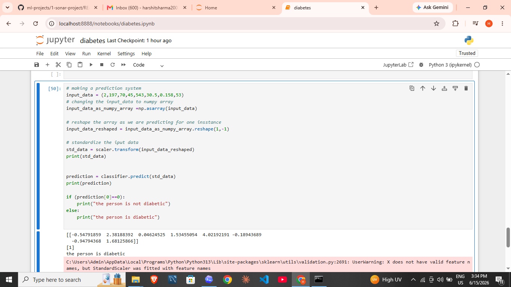

# Diabetes Project

Machine learning project that predicts diabetes outcome using a linear support vector machine classifier.

## Screenshots











## Files

- `data/diabetes.csv`: dataset used by the project
- `notebooks/diabetes_prediction_svm.ipynb`: Jupyter notebook
- `src/train.py`: runnable Python training script
- `requirements.txt`: Python dependencies

## Run

```bash
pip install -r requirements.txt
python src/train.py
```
