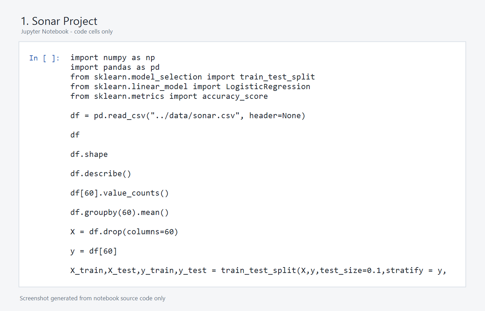
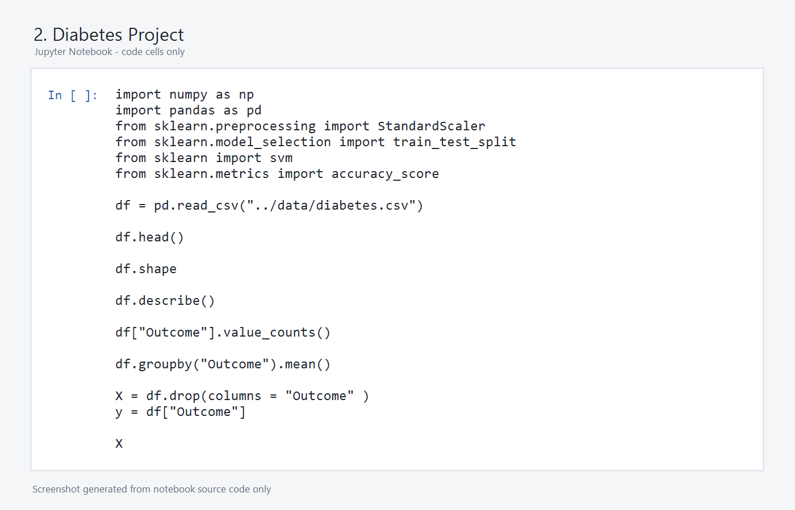

# ML Projects

This repository contains two machine learning projects in one organized place.

## ML Project

1. [Sonar Project](1-sonar-project)
2. [Diabetes Project](2-diabetes-project)

## Repository Structure

```text
.
├── 1-sonar-project/
│   ├── data/
│   ├── notebooks/
│   ├── screenshots/
│   ├── src/
│   ├── README.md
│   └── requirements.txt
├── 2-diabetes-project/
│   ├── data/
│   ├── notebooks/
│   ├── screenshots/
│   ├── src/
│   ├── README.md
│   └── requirements.txt
├── .gitignore
└── README.md
```

## Projects

### 1. Sonar Project

Classifies sonar signal readings as rock or mine using logistic regression.



### 2. Diabetes Project

Predicts diabetes outcome from diagnostic measurements using a linear SVM classifier.



## Author

[Harshit Sharma](https://github.com/harshitsharma200377-spec)
