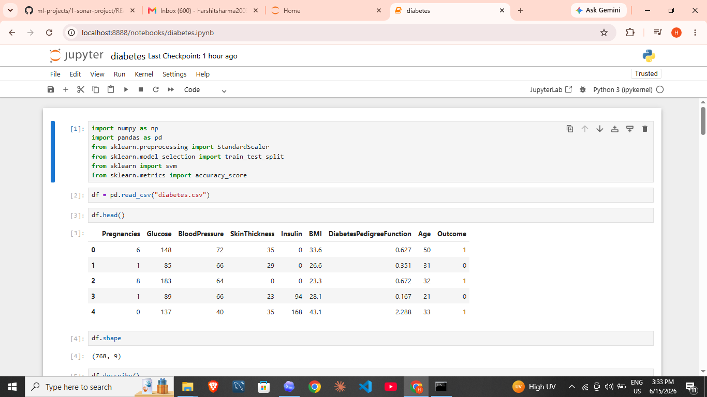

# 🤖 ML Projects

A collection of machine learning projects covering real-world classification problems — organized, documented, and ready to run.

## 📂 Projects

| # | Project | Algorithm | Accuracy |
|---|---------|-----------|----------|
| 1 | [🔊 Sonar Rock vs Mine](1-sonar-project) | Logistic Regression | ~83% |
| 2 | [🩺 Diabetes Prediction](2-diabetes-project) | Linear SVM | ~77% |

## 🗂️ Repository Structure
```text
.
+-- 1-sonar-project/
|   +-- data/
|   +-- notebooks/
|   +-- screenshots/
|   +-- src/
|   +-- README.md
|   +-- requirements.txt
+-- 2-diabetes-project/
|   +-- data/
|   +-- notebooks/
|   +-- screenshots/
|   +-- src/
|   +-- README.md
|   +-- requirements.txt
+-- .gitignore
+-- README.md
```

## 🔍 Project Previews

### 1. 🔊 Sonar Rock vs Mine Prediction
Classifies sonar signal readings as **rock or mine** using Logistic Regression.


### 2. 🩺 Diabetes Prediction System
Predicts whether a patient is **diabetic or not** from diagnostic measurements using a Linear SVM classifier.



## 🛠️ Tech Stack
- Python, NumPy, Pandas
- Scikit-learn
- Jupyter Notebook

## 👤 Author
[Harshit Sharma](https://github.com/harshitsharma200377-spec)
